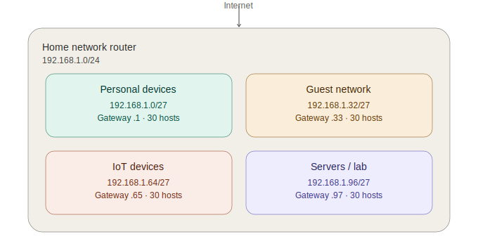

# Home Network Documentation & IP Scheme Design

## Overview
This project documents a segmented home network design — subnetting a single `/24` address block into four isolated zones, each serving a different device category. It demonstrates practical application of IP addressing, subnetting, and network segmentation principles.

## Why This Project
This builds on my **Cisco Networking Basics** certification, which covers IP addressing, the OSI/TCP-IP model, and network fundamentals. Rather than just calculating subnets on paper, this project applies that knowledge to a real network design with a clear security rationale: isolating device categories to limit the blast radius of a compromised device.

## Network Diagram

## IP Addressing Scheme

| Zone | Subnet | Usable Range | Gateway | Purpose |
|---|---|---|---|---|
| Personal devices | 192.168.1.0/27 | .1 – .30 | 192.168.1.1 | Laptops, phones, personal PCs |
| Guest network | 192.168.1.32/27 | .33 – .62 | 192.168.1.33 | Visitor devices, isolated from other zones |
| IoT devices | 192.168.1.64/27 | .65 – .94 | 192.168.1.65 | Smart plugs, cameras, sensors |
| Servers / lab | 192.168.1.96/27 | .97 – .126 | 192.168.1.97 | Home lab VMs, test servers, Packet Tracer devices |

**Subnet mask:** `255.255.255.224` (/27) — 32 addresses per subnet, 30 usable hosts per zone.

**Base network:** `192.168.1.0/24`, subnetted into four equal `/27` blocks (borrowing 3 bits from the host portion).

## Subnetting Breakdown

Starting from `192.168.1.0/24`:
- Default mask: `/24` = `255.255.255.0` → 256 addresses, 254 usable hosts
- Borrowed 3 bits for subnetting → new mask `/27` = `255.255.255.224`
- Each `/27` block = 32 addresses (2⁵) → 30 usable hosts (subtracting network + broadcast addresses)
- 2³ = 8 possible subnets created; 4 are used here, leaving 4 reserved for future expansion (e.g. a dedicated management VLAN)

## Design Principle: Segmentation

Each zone is placed on its own VLAN, with firewall/router rules restricting cross-zone traffic:

- **Guest → Personal / Servers / IoT:** Blocked. Guests should only reach the internet.
- **IoT → Personal / Servers:** Blocked. IoT devices are historically weak on security; isolating them limits damage if one is compromised.
- **Personal → all zones:** Allowed (trusted zone, e.g. for managing IoT devices or accessing lab servers).
- **Servers/Lab → Personal:** Allowed for management access; restricted from initiating connections to Guest/IoT.

This mirrors real-world network segmentation practices used in both home and enterprise environments to contain threats and limit lateral movement.

## Skills Demonstrated
- IP addressing and subnet calculation (CIDR, subnet masks, usable host ranges)
- Logical network segmentation and VLAN design
- Security-driven network architecture (least-privilege access between zones)
- Network diagramming and documentation

## Author
**Luxolo Nduduzo Mkhize**
Final-year BSc Computer Science & Mathematics student, University of Zululand
Cisco Networking Academy certified — Junior Cybersecurity Analyst Career Path
[LinkedIn](https://linkedin.com/in/luxolo-mkhize-008807370)
